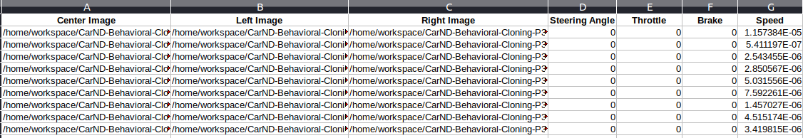
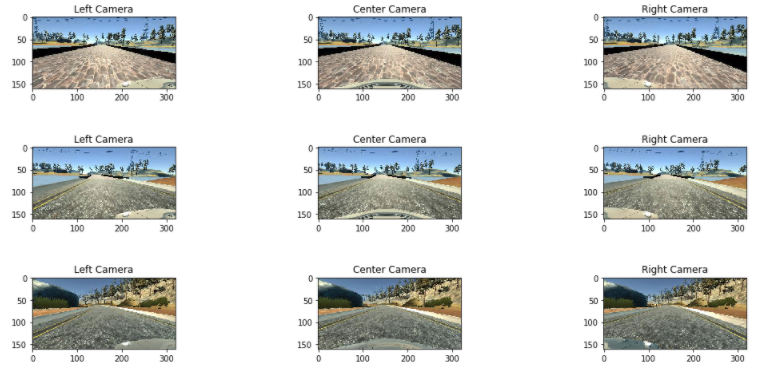
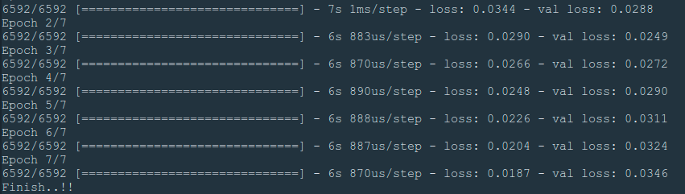

# **Behavioral Cloning** 

---

In this project, I have used what I've learned about deep neural networks and convolutional neural networks to clone driving behavior. I have trained, validated and tested a model using Keras for completing this project. The CNN architecture used here is referenced from NVIDIA's [End to End Learing from Self-Driving Cars paper](https://arxiv.org/pdf/1604.07316v1.pdf)

I have used a simulator from where I can steer a car around a track for data collection. I'll use image data and steering angles to train a neural network and then use this model to drive the car autonomously around the track.

The goals / steps of this project are the following:
* Use the simulator to collect data of good driving behavior
* Build, a convolution neural network in Keras that predicts steering angles from images
* Train and validate the model with a training and validation set
* Test that the model successfully drives around track one without leaving the road
* Summarize the results with a written report

[//]: # (Image References)

[image1]: ./examples/placeholder.png "Model Visualization"
[image2]: ./examples/placeholder.png "Grayscaling"
[image3]: ./examples/placeholder_small.png "Recovery Image"
[image4]: ./examples/placeholder_small.png "Recovery Image"
[image5]: ./examples/placeholder_small.png "Recovery Image"
[image6]: ./examples/placeholder_small.png "Normal Image"
[image7]: ./examples/placeholder_small.png "Flipped Image"

## Project includes all required files which can be used to run the simulator in autonomous mode

This reprository contains following five files:

* finalPipeline.py (script to create and train the model) 
* drive.py (script to drive the car once the Network has been trained)
* model.h5 (a trained Keras model)
* a report to explain the project
* video.mp4 - recording of the vehcile driving autonomously around the track.

The finalPipeline.py file contains the code for training and saving the convolution neural network. The file shows the pipeline I used for training and validating the model, and it contains comments to explain how the code works.

## The Objective of the Project:

The main objective was to create and validate a CNN model that clones a driving behavior from a simulator. A Simulator which allowed to collect data like steering angle and capture surrounding environment with the help of 3 cameras mounted on left, center and right side of the vehicle. Following is the snapshot of data collected:

## Data Collection Strategy:

For collecting data, 2 laps of the track has been completed as follows:

* Majority of the first lap data was collected by maintaining the vehicle on the middle line as much as possible and making smooth turns.

* During second lap, unstable driving was carried out that is by intentionally swarling the car from left corner to right corner of the road.

## The Pipeline:

### 1) Loading the raw data:

In this step, we have to first make all the collected data readable by our code, such as reading the images corrosponding to those images what steering inputs were given and so on.

### 2) Dataset Summary and Visual Exploration:

The dataset contains 8244 camera images in total that is 2748 for each camera. Random 3 camera sets are visualized to check whether the data is imported successfully. Following is their visualization:

### 3) Data Augmentation:

The images captured by the cameras have a lot of irrelevent parts which are nothing but distraction for the neural network. So I cropped to remove irrelevent parts of the image such as the hood of the car and the sky as you can see in the image above.

Also, we did not have equal amount of left and right turns throughout the track. So, to counter this issue I flipped all the images and also multiplied their steering angles with -1 so that steering angles are also flipped along with the images.

### 4) Image Pre-Processing:

In image pre-processing I didn't carried out much steps except image resizing. As the outcome of the architecture was good as expected, I didn't felt the need to further process the image.

### 5) CNN Architecture:

Following is the architecture of CNN I used to train my model:

This architecture is developed by NVIDIA for end to end learing for Self-Driving Cars. They have trained a Convolution Neural Network to map raw pixels from a single- front facing camera directly to steering commands. This end-to-end approach proved surprisingly powerful. With minimum data from humans the system learns to drive in traffic on local roads with or without lane markings. In their paper they have mentioned that this system learns internal representations of the necessary processing steps such as detecting useful road features with only human steering angle as the training signal. This architecture was a perfect fit for our use as I had a similar scenario for this project.

Reference : https://arxiv.org/pdf/1604.07316v1.pdf

### 6) Compiling and saving the model:

Finally, the model is compiled using a Mean Square Error (MSE) loss function and Adaptive moment estimation optimizer (ADAM) which reduced the efforts of manually training the learing rate. validation split was set to 20% of the data.

The number of Epochs were set to 7 for training the network. Following is the result of those 7 Epoches.

## Conclusion and Future Direction:

In this project, I worked on regression problem in the context of self-driving cars. Initially, the main focus was on to finding a suitable network architecture and train a model using our own dataset. According to Mean Square Error (MSE) our model worked well. Also, by using data Augmentation we were further able to improve the performance of the network.

For future direction:
* Training the data on other tracks or if possible training the model in real road conditions would help it further improve.

* Experiment with other possible data argumentation techniques would also be an interesting one to see.

* To make it more real life like driving, we can introduce other traffic agents which would affect the decisions made by our ego vehicle and learn to navigate in a traffic condition.
